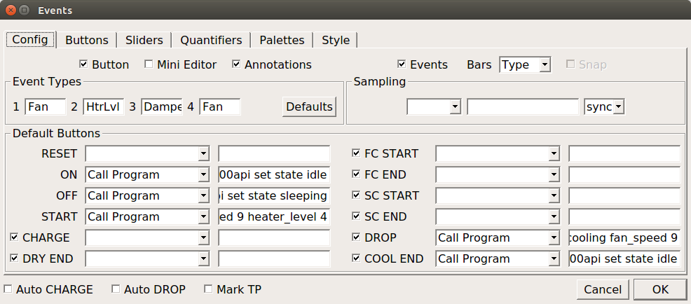
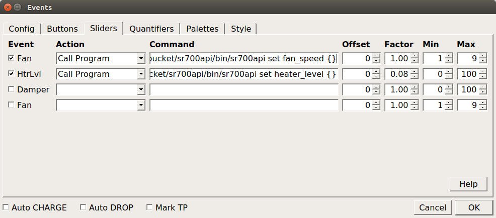
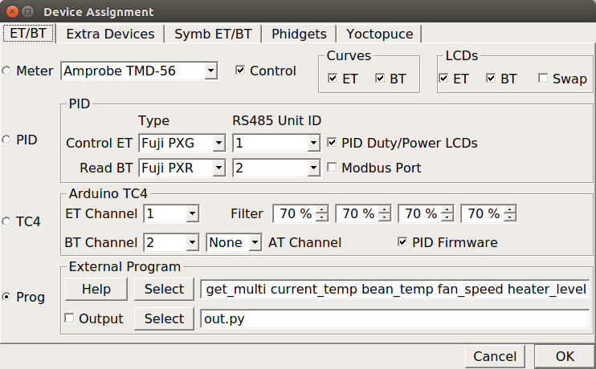
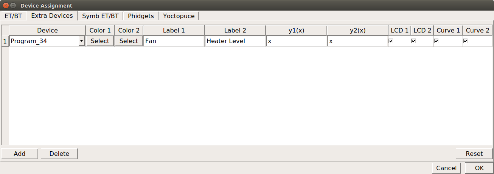
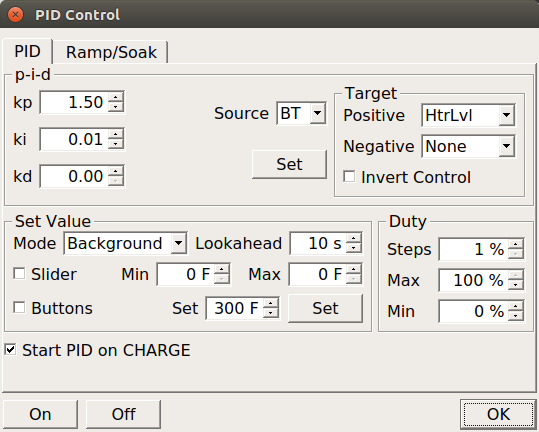

# sr700api
A python package to help connect a Freshroast SR700 roaster to Artisan coffee raosting software running on Linux systems. This package allows the control of an SR700 as well as the reading of a bean temperature thermocouple, accessible via USB via a Bus Pirate v3 board connected to a MAX31855K chip over SPI.

## Before you read any further...

THE SOFTWARE IS PROVIDED "AS IS", WITHOUT WARRANTY OF ANY KIND, EXPRESS OR IMPLIED, INCLUDING BUT NOT LIMITED TO THE WARRANTIES OF MERCHANTABILITY, FITNESS FOR A PARTICULAR PURPOSE AND NONINFRINGEMENT. IN NO EVENT SHALL THE AUTHORS OR COPYRIGHT HOLDERS BE LIABLE FOR ANY CLAIM, DAMAGES OR OTHER LIABILITY, WHETHER IN AN ACTION OF CONTRACT, TORT OR OTHERWISE, ARISING FROM, OUT OF OR IN CONNECTION WITH THE SOFTWARE OR THE USE OR OTHER DEALINGS IN THE SOFTWARE.

YOU RUN THE RISK OF LOSING CONTROL OF YOUR ROASTER WITH THIS SYSTEM.  ARTISAN IS A COMPLICATED APP, AND THIS PACKAGE IS ALPHA-LEVEL SOFTWARE.

This software and hardware approach to using the SR700 implies a certain level of comfort with the Artisan coffee roasting application, Linux, computer programming (python specifically), soldering wires and connectors, and Dremel tool handiness. If you do not fit this profile, this package is not for you.

## Requirements

* Artisan 1.1.0 installed on a Lniux system (the author used Ubuntu 16.04)
* python 3, because the
* pyBusPirateLite python package works with python 3
* a number of other python packages, as listed in `requirements.txt`

## Installation - Ubuntu 16.04

* remember that you need to invoke python3 and its tools, because in Ubuntu 16.04, python 2.7 is still the default interpreter.
* install python requirements by navigating to the root folder of this project and running `[sudo] pip3 install -r requirements.txt`. Note that this installs the non-PyPI byBusPirateLite package in addition to other requirements. pyBusPirateLite is at [https://github.com/juhasch/pyBusPirateLite](https://github.com/juhasch/pyBusPirateLite).
* cd to the sr700api folder and invoke `[sudo] pip3 install .`, this will install, among other things, a script in `/usr/local/bin` that you can invoke by typing `sr700api` in any terminal. It is used to interface with both the SR700 and the bean temperature probe.

## Usage in a nutshell

Once installed, from any Terminal window, you should be able to type `sr700api --help` to see available commands. The general idea with the command line is this:
```
>sr700api startup
True
>sr700api get current_temp
150.0
>sr700api set fan_speed 9
>sr700api set state roasting
>sr700api set_multi heater_level 8 fan_speed 7
>sr700api get_multi current_temp bean_temp
150.0,85.4
>sr700api set state sleeping
>sr700api shutdown
```
In other words,

* you start a session with `sr700api startup`. This launches a local REST server (think of it as a service or daemon), which immediately sets up a connection both with the SR700 and the bean probe electronics.  It returns `True` when it has successfully connected to that equipment.  The SR700 requires constant communication with the computer, so the REST server creates the proper context to let that happen.
* There are currently four verbs you can use with the script after startup: `get`, `get_multi`, `set`, and `set_multi`. The GETs return data in a format most useful for ingestion into the Artisan application.  The SETs allow control of the hardware from the Artisan application.
* Once you're done with a roasting session, `sr700api shutdown` disconnects from hardware and shuts down the local REST server.
* Use `sr700api --help` to get a list of parameters you can get and set.

## Usage in Artisan 1.1.0 - Ubuntu 16.04

* You will need to open a Terminal window.  We will use this Terminal to start and stop the sr700api service. (For some reason, Artisan itself, when invoking sr700api, cannot cause the launching of new processes... to be worked out someday!).
* Invoke `sr700api startup` in a terminal window to start the REST server.
* Launch Artisan, assuming it is configured to control the SR700 device (see details in following section).
* Once you're done with Artisan, you can manually shut down the REST server by invoking`sr700api shutdown` in the terminal window.

## Setting up the hardware

### Getting the Materials

* This software was designed for a particular hot-rodded SR700 setup - namely, the addition of a bean temperature probe to the unit.
* This setup requires some soldering skills, as one of the electronics boards has no connector headers on it.
* This setup requires some hardware hacking skills, as you need to very slightly modify the SR700 chaff collector to run the thermocouple wire through, as well as bend the thermocouple to the proper shape.
* Hardware shopping list:

| Qty | Item | Seller | Part Num | Where to Find |
| --- | --- | --- | --- | --- |
| 1 | thermocouple | Omega | KTXL-116U-12 | omega.com |
| 1 | male connector | Omega| SMPW-K-M-ROHS | omega.com |
| 2 | SS cable ties | varies | SSCT05-255"  | SSCT05-255" Type 304 Self-Lock Stainless Steel Cable Ties |
| 1 | Bus Pirate v3 | Sparkfun | TOL-12942 | [https://www.sparkfun.com/products/12942](https://www.sparkfun.com/products/12942) |
| 1 | MAX31855K board | Sparkfun | SEN-13266 | [https://www.sparkfun.com/products/13266](https://www.sparkfun.com/products/13266) |
| 1 |  female connector | Sparkfun | PRT-13612 | [https://www.sparkfun.com/products/13612](https://www.sparkfun.com/products/13612) |
| 1 | Bus Pirate cable | Sparkfun | CAB-09556 | [https://www.sparkfun.com/products/9556](https://www.sparkfun.com/products/9556) |
| 1 | Male headers | Sparkfun | PRT-00116 | [https://www.sparkfun.com/products/116](https://www.sparkfun.com/products/116) |
| 1 | USB Mini-B Cable | Sparkfun | CAB-11301 | [https://www.sparkfun.com/products/11301](https://www.sparkfun.com/products/11301) |

### Installing the thermocouple in the SR700

The aim is to get the tip of the thermouple midway into the bean mass, off to one side (versus dead center into the airstream).  The tip of the probe should protude well below the metal ring on the SR700's glass container. The tip of the probe should also be well to the side, so that the probe is not measuring the upwash of the primary airstream. I position my probe about 1/2 inch from the edge of the glass.

* First, you need to put a notch in the edge of the chaff collector to route the thermouple out of the roaster.
* Then, you need to deftly bend the thermocouple to route it up through and then around the inner rim of the chaff collector, then out through the notch you just created. The thermocouple I specified in the parts list is very easy to bend and as long as you're a little handy, you'll be able to handle making the bends.
* Finally, the probe is held in place using the stainless steel cable ties.  Some people use aluminum foil pieces as ties, I preferred these stainless steel ties, although they're a marginal fit in this application.

### Putting the thermocouple electronics together

This is not a how-to on soldering techniques - this is just a summary list of things to be done.

* Break 6 pins off the header and solder that header to the MAX31855K board.
* Connect the Pus Pirate cable to the Bus Pirate.  It only goes in one way.
* Connect the Bus Pirate to the MAX31855K board as follows:
    * GND to GND
    * 3V3 to VCC
    * CLK to SCK
    * CS to /CS
    * MISO to SO
* Solder the female thermocouple connector to the MAX31855K board.
* Connect the thermocouple to the male connector, no soldering is required, the recommended connector uses screw terminals. It is critically important to get the thermocouple polarity correct, the + and - terminals. For the equipment I received, the silver sheathed wire goes to plus (+), and the bronze sheathed wire goes to minus (-).
* Connect the thermocouple's connector to the MAX31855K's connector.
* Plug the USB mini-B cable into the Pus Pirate, then into your computer. The board and thermocouple are powered by your computer's USB port.

## Setting up Artisan to use the sr700api

* Install Artisan 1.1.0 or later from [https://github.com/artisan-roaster-scope/artisan](https://github.com/artisan-roaster-scope/artisan).

* Artisan is a very flexible, powerful piece of software that consequently has a number of setup details that you must get right in order to use this software successfully.
    * It is important to note that it is possible to setup Artisan very differently from what is suggested here, and successfully use sr700api to control the SR700.  What follows is my preferred setup.

* Here's a summary of the configuration that I use in Artisan. Familiarity with Artisan is assumed.
    * I have a slider that I use to manually control the fan speed.  I setup the system to start up with the fan at 9, and I control it manually throughout the roast.
    * I use Artisan's PID control software to drive the bean temperature to a temperature profile that I design in Artisan beforehand. To do this, I use the freshroastsr700 python package to drive the 8-segment software heater algorithm to control heat input (instead of the SR700 hardware's Lo/Mid/Hi heater).
    * The heater is mapped to a slider that the Artisan PID controller manipulates on my behalf throughout the roast.  It uses the bean temperature data and the background profile to determine how to drive the heater.
    * I added specific actions to the On, Start, Drop, Cool End, and Off buttons to setup the roaster to behave as expected. Pressing Start starts the fan and sets up the heater to drive at a middle heating level. Pressing Drop sets the SR700 in cooling mode with the fan at max. Cool End shuts down the roaster.
    * I graph the Bean Temp, Exhaust Temp (which is really the heating chamber temp, the temperature sensor inside the SR700 unit), fan speed and heater level.
    * I use no alarms or other programmed logic to control the roast.

* Important General Artisan settings
    * While you can configure the sr700api to return values in Celsius, the configuration described here is in Fahrenheit. Please ensure that Artisan is in Fahrenheit mode by going to Roast -> Temperature -> Fahrenheit mode.

* Setting up Artisan to map buttons and sliders to hardware
    * In the Config menu, select Events. The Events dialog appears. The Config tab is set up as shown below.
    
    * The important elements here are:
        * Event Types area - Event Types 1 should be Fan, and Event Types 2 should be HtrLvl.  3 and 4 are not used and can be anything.
        * I decided to control the hardware with the ON, OFF, START, DROP, and COOL END buttons. For these buttons, select `Call Program` from the dropdown box, as shown, and in the edit boxes, enter the following scripts:
            * ON: `sr700api set state idle`
            * OFF `sr700api set state sleeping`
            * START: `sr700api set_multi state roasting fan_speed 9 heater_level 4`
            * DROP: `sr700api set_multi state cooling fan_speed 9`
            * COOL END: `sr700api set state idle`
    * Still in the Events dialog, go to the Sliders tab, it should look as follows.
    
    * The Fan and HtrLvl Events must be checked, and the other 2 unchecked.
    * The Action for Fan must be `Call Program` and the Command script is `sr700api set fan_speed {}`. Note also the Offset, Factor, Min and Max values - they must be set as shown.
    * The Action for HtrLvl must be `Call Program` and the Command script is `sr700api set heater_level {}`. Note also the Offset, Factor, Min and Max values - they must be set as shown.  This is critically important here, as the PID controller is set up to write values from 0 to 100 and these scaling factors map those numbers to heater_level 0 through 8.

* Setting up Artisan to read data from the hardware.
    * In the Config menu, select Device. The Device dialog appears. The ET/BT tab is set up as shown below.
    
    * Note that the
        * Control checkbox is checked - this enables the PID controller
        * Both ET and BT curves and LCD checkboxes are checked
        * the Prog radio button is selected. This is critical, as you will be running a program to communicate with the SR700, and that program is sr700api, this package.
        * in the External Program area, the first edit box has the following text in it, and you should use the same text: `sr700api get_multi current_temp bean_temp fan_speed heater_level`.
    * Still in the Config->Device dialog, the Extra Devices tab should have the following entry in it. This entry ensures that all four pieces of data - ET, BT, fan speed and heater level - are all logged by Artisan.
    

* Setting up the Artisan PID Controller
    * At this point, you should see a Control button near the top right corner of the Artisan application. Press it, and you'll be presented with the PID Control dialog, as shown below.
    
    * The PID controller is not finely tuned, but the numbers shown here seem to work OK. Please copy in all the values shown in the screenshot above as-is into the PID Control dialog. If any value is off or incorrect, the PID Control will definitely NOT work.

## Running a Roast with this setup

At this point, setup is complete, and in theory, everything is ready to run. However, the Artisan setup is configured for the author's approach to roasting and using Artisan, which may not match your understanding or use of Artisan. So I will run you through how I use this setup.

* Launch a Terminal window. Type `sr700api startup` to start the sr700api service.
* Launch Artisan.
* Load a background profile. I design my profiles using Artisan's profile designer, under Tools->Designer.
    * IMPORTANT - the setup described above needs a background profile loaded to drive the roast. Go to Roast->Background to load the background profile. The PID controller is set up to track a background roast profile. (It can instead be set up to follow ramp/soak profiles, like Openroast does, but I don't explain that here.)
* Press the ON button.  The display changes a little, two sliders appear on the left side, `fan` and `HtrLvl`.  You can control both these sliders. However, the PID controller controls the HtrLvl slider during the roast, you'll see it move up and down as it tries to drive the bean temperature to match the background profile.
* Press the START button. Now the roaster comes to life, and the fan and heater activate on the roaster.
* I wait a while for the roast chamber to heat up, typically until the bean probe reaches about 300F, sometimes I have to play with the HtrLvl slider to achieve this.
* I also forcibly set the Fan slider to 9, because it's disconcerting to see the mismatch between the actual fan speed and the slider.
* I charge the roaster beans into the roaster by pouring beans into it.
* I click the CHARGE button.  At this point, the PID control kicks in, and the system tries to match the background profile.
* I will mark the DRY END, FCS, FCE, and SCS moments with the buttons. These just mark the graph in my implementation, the roaster's behavior is never altered at those moments.
* Throughout the roast, I manualy gradually decrease the fan speed as the beans lose density. I do this by moving the Fan slider. I typically end up at five by the end of the roast.
* When I'm ready to start cooling, I press the DROP button.  This causes the roaster to enter cooling mode, and the fan speed is set to 9.
* When it's cool enough, I press the COOL END button. This stops the roaster.
* I'll press the OFF button after that, and then enter roast parameters in the Roast->Properties dialog, and finally, I'll save the logged roast to file.
* Close Artisan.
* In the Terminal window we started in the first step, I type `sr700api shutdown` to terminate the hardware connections and the service.

## License

Distributed under MIT License, see LICENSE.txt.

## Version History

### v0.1.3
First complete draft of this package. README needs more work, in terms of how-to visuals.
